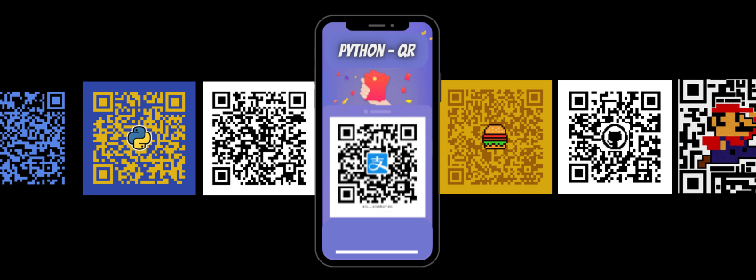

<p align="center">
  
</p>


# QR Code Generator

Este proyecto contiene dos scripts en Python para generar códigos QR:

* **main.py**: Generador de códigos QR básicos.
* **QR_LOGO.py**: Generador de códigos QR personalizados con colores y logo.

Ambos scripts utilizan la librería `qrcode` y están pensados para ser simples, claros y fáciles de usar desde la terminal.

---

## Requisitos

* Python 3.8 o superior
* Librerías necesarias:

```bash
pip install qrcode[pil] pillow
```

---

## Ejemplo básico: main.py

Este script permite generar un código QR simple a partir de una URL ingresada por el usuario.

### Código

```python
import qrcode

data = input("ingrese la URL:")
qr = qrcode.QRCode(
    version = 1,
    error_correction=qrcode.constants.ERROR_CORRECT_H,
    box_size=10,
    border=4
)
qr.add_data(data)
qr.make(fit=True)
img = qr.make_image(fill_color="black", back_color="white")

img.save("QR.png")
print("QR generado!!")
```

### Funcionamiento

1. El usuario ingresa una URL por consola.
2. Se genera un código QR estándar en blanco y negro.
3. El archivo se guarda como `QR.png` en el mismo directorio.

---

## Generador avanzado: QR_LOGO.py

Este script permite generar un código QR personalizado, agregando:

* Color del QR en formato hexadecimal.
* Color de fondo en formato hexadecimal.
* Un logo centrado en el QR (imagen PNG).

Está pensado para usos más profesionales, como marcas o proyectos visuales.

---

## Características principales

* Validación de entrada del usuario.
* Soporte para colores personalizados.
* Inserción de logo con transparencia.
* Corrección de errores alta para mantener la legibilidad del QR.

---

## Uso de QR_LOGO.py

Ejecutar el script desde la terminal:

```bash
python QR_LOGO.py
```

El programa solicitará:

1. URL a codificar (obligatoria).
2. Color del QR en hexadecimal (por defecto negro).
3. Color de fondo en hexadecimal (por defecto blanco).
4. Ruta del archivo de logo en formato PNG.

Si alguno de los datos es inválido, el programa finalizará mostrando un mensaje de error.

---

## Salida

El código QR generado se guarda como:

```
MyQR.png
```

en el directorio donde se ejecuta el script.

---

## Notas

* El logo se redimensiona automáticamente al 25% del tamaño del QR.
* Se utiliza un nivel alto de corrección de errores para evitar problemas de lectura.
* Se recomienda usar logos simples y con fondo transparente.

---

## Licencia

Proyecto de uso libre con fines educativos y personales.
